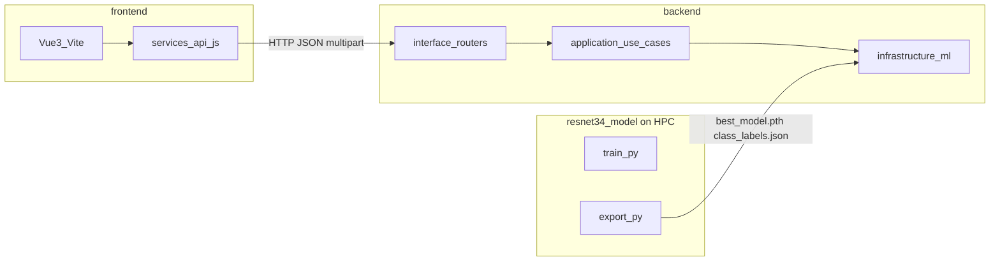

# Implementation Plan v2: AI-Based Tomato Leaf Disease Detection System

**FYP by Sia Jia Le (22062566) — Sunway University**

This document merges [implementation_plan.md](implementation_plan.md) with amendments for **API-first frontend/backend separation**, **Sunway HPC GPU training**, and **Phase 0 scaffold** (folder structure + placeholder files only—no business logic yet).

---

## v2 Amendments Summary

| Topic | v1 (original) | v2 (this document) |
|-------|---------------|-------------------|
| Frontend ↔ backend | REST implied | **Explicit REST contract**: one HTTP endpoint per router/controller method; frontend uses only `frontend/src/services/api.js` |
| API paths | `/predict`, `/health` | Versioned prefix: **`/api/v1/*`** |
| Deployment | Docker Compose for all | **Decoupled**: frontend and backend build/run independently; Compose optional for local dev |
| GPU training | Local NVIDIA Docker | **Sunway University HPC** primary; Docker/Singularity first, **Python venv + Slurm** fallback |
| Repo state | Plan only | **Phase 0 complete**: scaffold files in repo (stubs return 501 except health) |

---

## Overview

Monorepo layout:

```
AI-Based-Tomato-Leaf-Disease-Detection-Using-Image-Recognition/
├── backend/          # FastAPI (Python) — REST API + DDD business logic
├── frontend/         # Vue 3 — Web UI (calls backend via HTTP only)
├── resnet34_model/   # PyTorch training, evaluation, model export (+ HPC scripts)
├── docker-compose.yml
├── .env.example
├── .gitignore
└── README.md
```

---

## Architecture: Decoupled Frontend and Backend



**Rules for swapping frontends later (React, mobile, etc.):**

- Backend exposes OpenAPI at `/docs`.
- Frontend reads `VITE_API_URL` only; no backend URLs outside `services/api.js`.
- CORS allowlist is env-driven (`CORS_ORIGINS`).

---

## API Contract: Controller Method → Endpoint

Each **public** router function maps to exactly one HTTP route. Use cases are internal.

| Router file | Controller method | HTTP | Path | Frontend (`api.js`) |
|-------------|-------------------|------|------|---------------------|
| `health_router.py` | `health_check` | GET | `/api/v1/health` | `getHealth()` |
| `prediction_router.py` | `predict_disease` | POST | `/api/v1/predict` | `predict(file)` |
| `prediction_router.py` | `list_predictions` | GET | `/api/v1/predictions` | `listPredictions()` |
| `prediction_router.py` | `get_prediction_by_id` | GET | `/api/v1/predictions/{prediction_id}` | `getPrediction(id)` |

### Scaffold behavior (Phase 0)

| Endpoint | Status | Response |
|----------|--------|----------|
| `GET /api/v1/health` | 200 | `{"status": "ok", "model_loaded": false}` |
| `POST /api/v1/predict` | 501 | `{"detail": "Not implemented"}` |
| `GET /api/v1/predictions` | 501 | `{"detail": "Not implemented"}` |
| `GET /api/v1/predictions/{id}` | 501 | `{"detail": "Not implemented"}` |

### `POST /api/v1/predict` (target contract)

**Request:** `multipart/form-data`, field `image` (JPEG/PNG)

**Response:**

```json
{
  "prediction_id": "uuid-...",
  "label": "Early_Blight",
  "confidence": 0.9423,
  "advice": "Apply copper-based fungicide. Remove infected leaves.",
  "timestamp": "2026-05-29T10:30:00Z"
}
```

---

## Sunway University HPC — GPU Training

Training runs on **Sunway HPC**, not on the API server. Two paths (try A first).

### Path A (primary): Docker / Singularity on HPC

1. Build image: `docker build -t tomato-trainer ./resnet34_model`
2. Convert or pull on HPC as **Singularity/Apptainer** image (cluster policy varies).
3. Submit Slurm job: `sbatch scripts/hpc/train_slurm.sh`
4. Write artifacts to shared project path: `resnet34_model/outputs/` (`best_model.pth`, `class_labels.json`).

Scripts: `resnet34_model/scripts/hpc/train_slurm.sh`, `run_training_docker.sh`, `README.md` (fill partition/module names when IT confirms).

### Path B (fallback): venv on HPC

```bash
python -m venv ~/venvs/tomato-ml
source ~/venvs/tomato-ml/bin/activate
module load cuda   # exact module from Sunway docs
pip install -r requirements.txt
python src/train.py
```

Use the same Slurm wrapper; replace container invocation with venv activation.

### Local training (optional)

```bash
docker compose --profile training up model_trainer
```

Requires NVIDIA Container Toolkit locally.

### Inference GPU

Backend inference may use **CPU** for FYP unless HPC policy requires GPU for the API—decide in Phase 7.

---

## 1. Top-Level Structure

| File | Purpose |
|------|---------|
| `docker-compose.yml` | `backend` + `frontend`; `model_trainer` with `profiles: [training]` |
| `.env.example` | Shared env template |
| `.gitignore` | Ignore data, weights, `node_modules`, `.env` |
| `README.md` | Quick start |

### docker-compose.yml — Services

| Service | Build | Port | Role |
|---------|-------|------|------|
| `backend` | `./backend` | 8000 | FastAPI REST API |
| `frontend` | `./frontend` | 5173 | Vue 3 (Vite) |
| `model_trainer` | `./resnet34_model` | — | Training (profile `training`) |

**Run app:** `docker compose up backend frontend`  
**Run training (local GPU):** `docker compose --profile training up model_trainer`

---

## 2. `resnet34_model/` — Deep Learning Module

Standalone Python module for ML lifecycle: training, evaluation, export.

### Folder structure

```
resnet34_model/
├── Dockerfile
├── requirements.txt
├── data/
│   ├── raw/                    # PlantVillage (gitignored except .gitkeep)
│   │   ├── Tomato_Bacterial_Spot/
│   │   ├── Tomato_Early_Blight/
│   │   ├── Tomato_Late_Blight/
│   │   ├── Tomato_Leaf_Mold/
│   │   ├── Tomato_Septoria_Leaf_Spot/
│   │   ├── Tomato_Spider_Mites/
│   │   ├── Tomato_Target_Spot/
│   │   ├── Tomato_Yellow_Leaf_Curl_Virus/
│   │   ├── Tomato_Mosaic_Virus/
│   │   └── Tomato_Healthy/
│   └── processed/
│       ├── train/
│       ├── val/
│       └── test/
├── src/
│   ├── config.py
│   ├── dataset.py
│   ├── model.py
│   ├── train.py
│   ├── evaluate.py
│   ├── export.py
│   └── utils.py
├── notebooks/
│   └── exploratory_analysis.ipynb
├── outputs/
│   ├── checkpoints/
│   ├── best_model.pth          # gitignored
│   ├── class_labels.json
│   └── evaluation_report/
└── scripts/
    ├── prepare_dataset.py
    ├── run_training.sh
    └── hpc/
        ├── README.md
        ├── train_slurm.sh
        └── run_training_docker.sh
```

### Key design (unchanged from v1)

**`src/config.py`**

```python
IMAGE_SIZE = 224
BATCH_SIZE = 32
NUM_CLASSES = 10
STAGE_A_LR = 1e-3
STAGE_B_LR = 1e-4
STAGE_A_EPOCHS = 15
STAGE_B_EPOCHS = 25
EARLY_STOPPING_PATIENCE = 7
DATASET_SPLIT = (0.70, 0.15, 0.15)
IMAGENET_MEAN = [0.485, 0.456, 0.406]
IMAGENET_STD  = [0.229, 0.224, 0.225]
```

**Training transforms** — `RandomResizedCrop`, flip, rotation, `ColorJitter`; val/test: `Resize(256)`, `CenterCrop(224)`, normalize.

**Two-stage training:** Stage A — frozen backbone, train `fc`; Stage B — unfreeze `layer4` + `fc`, lower LR.

**`export.py`:** `outputs/best_model.pth` + `class_labels.json` with exact `ImageFolder` index mapping.

### Dockerfile

```dockerfile
FROM pytorch/pytorch:2.2.0-cuda12.1-cudnn8-runtime
WORKDIR /app
COPY requirements.txt .
RUN pip install --no-cache-dir -r requirements.txt
COPY . .
CMD ["python", "src/train.py"]
```

### requirements.txt

```
torch==2.2.0
torchvision==0.17.0
numpy
scikit-learn
matplotlib
seaborn
Pillow
tqdm
```

---

## 3. `backend/` — FastAPI + DDD

Four layers: Domain → Application → Infrastructure → Interface.

### Folder structure

```
backend/
├── Dockerfile
├── requirements.txt
├── main.py
├── domain/
│   ├── entities/       prediction.py, disease.py
│   ├── repositories/     prediction_repository.py (ABC)
│   └── services/       disease_service.py
├── application/
│   ├── use_cases/      predict_disease.py, get_prediction_history.py
│   └── dtos/           prediction_request.py, prediction_response.py
├── infrastructure/
│   ├── ml/             resnet34_inferencer.py, preprocessor.py, postprocessor.py
│   ├── persistence/    sqlite_prediction_repo.py, database.py
│   └── storage/        image_store.py
├── interface/
│   ├── routers/        health_router.py, prediction_router.py
│   └── middleware/     cors.py
├── shared/             config.py, exceptions.py
├── tests/              unit/, integration/
└── uploads/
```

### DDD rules

- `domain/` — no FastAPI, SQLAlchemy, torch
- `application/` — no FastAPI/SQLAlchemy imports
- `infrastructure/` — implements domain repository interfaces
- `interface/` — calls application use cases only

### Inferencer (target design)

```python
class ResNet34Inferencer:
    def __init__(self, model_path: str, labels_path: str):
        self.model = self._load_model(model_path)
        self.labels = self._load_labels(labels_path)

    def predict(self, image) -> tuple[str, float]:
        # preprocess → forward → softmax → top-1
        ...
```

### Dockerfile & requirements

```dockerfile
FROM python:3.11-slim
WORKDIR /app
COPY requirements.txt .
RUN pip install --no-cache-dir -r requirements.txt
COPY . .
CMD ["uvicorn", "main:app", "--host", "0.0.0.0", "--port", "8000", "--reload"]
```

```
fastapi==0.111.0
uvicorn[standard]
python-multipart
torch==2.2.0
torchvision==0.17.0
Pillow
SQLAlchemy
aiosqlite
pydantic-settings
pytest
httpx
```

---

## 4. `frontend/` — Vue 3

All backend access via `src/services/api.js` → `VITE_API_URL`.

### Folder structure

```
frontend/
├── Dockerfile
├── package.json
├── vite.config.js
├── index.html
├── .env.example
├── public/favicon.svg
└── src/
    ├── main.js, App.vue
    ├── assets/styles/main.css, theme.css
    ├── components/layout/, prediction/, history/
    ├── views/HomeView.vue, DetectView.vue, HistoryView.vue
    ├── stores/predictionStore.js
    ├── services/api.js
    └── router/index.js
```

### Target `api.js` pattern

```javascript
import axios from 'axios'
const api = axios.create({
  baseURL: import.meta.env.VITE_API_URL || 'http://localhost:8000',
  timeout: 30000,
})
export const getHealth = () => api.get('/api/v1/health')
export const predict = (file) => { /* FormData → POST /api/v1/predict */ }
export const listPredictions = () => api.get('/api/v1/predictions')
export const getPrediction = (id) => api.get(`/api/v1/predictions/${id}`)
```

---

## 5. Data Flow

```
resnet34_model/  →  train + export  →  best_model.pth, class_labels.json
        ↓ (copy to backend model_artifacts or volume)
backend/         →  load model, POST /api/v1/predict
        ↓ HTTP
frontend/        →  Vue UI via api.js
```

---

## 6. Development Phases (CP2)

| Phase | Week | Deliverable |
|-------|------|-------------|
| 0 | — | **Scaffold** (current): folders, stubs, GitHub push |
| 1 | 1 | Docker/HPC smoke test; health endpoint |
| 2 | 2 | `prepare_dataset.py`, 70:15:15 split |
| 3 | 3 | Augmentation + preprocessing parity |
| 4 | 4 | ResNet34 Stage A |
| 5 | 5–6 | Stage B, early stopping, export |
| 6 | 7 | `evaluate.py`, metrics |
| 7 | 8 | Backend use cases + inferencer + Vue workflow |
| 8 | 9 | Integration tests |
| 9 | 10 | Analysis |
| 10 | 11–12 | Report + presentation |

---

## 7. Critical Implementation Notes

1. **Preprocessing parity** — same transforms in `resnet34_model/src/dataset.py` and `backend/infrastructure/ml/preprocessor.py`.
2. **Class labels** — `class_labels.json` must match training `class_to_idx`.
3. **CORS** — env `CORS_ORIGINS` for frontend origin(s).
4. **No shared code** between `frontend/` and `backend/` Python packages.

---

## 8. Technology Summary

| Layer | Technology |
|-------|------------|
| ML | PyTorch 2.2, Torchvision, ResNet34 |
| Backend | FastAPI, SQLAlchemy, SQLite |
| Frontend | Vue 3, Vite, Pinia, Axios |
| Local dev | Docker Compose |
| HPC training | Slurm + Singularity/Docker (primary) or venv (fallback) |

---

## 9. Phase 0 Scaffold Checklist

After scaffold generation, verify:

- [ ] `docker compose up --build` starts backend + frontend
- [ ] `GET http://localhost:8000/api/v1/health` → 200
- [ ] `POST http://localhost:8000/api/v1/predict` → 501 (expected until Phase 7)
- [ ] Git push excludes raw images and `.pth` files

**Next phase:** implement use cases, ML pipeline, and UI—not scaffold stubs.

---

## Appendix A: Root files (Phase 0)

See committed files: `.gitignore`, `.env.example`, `README.md`, `docker-compose.yml`.

---

## Appendix B: `.gitignore` essentials

- `resnet34_model/data/raw/**` (keep `.gitkeep`)
- `resnet34_model/outputs/*.pth`
- `backend/uploads/*` (keep `.gitkeep`)
- `node_modules/`, `.env`, `__pycache__/`, `.venv/`

---

*Supersedes endpoint paths in v1 where they conflict (`/api/v1` prefix). All other v1 technical content remains valid unless noted above.*
